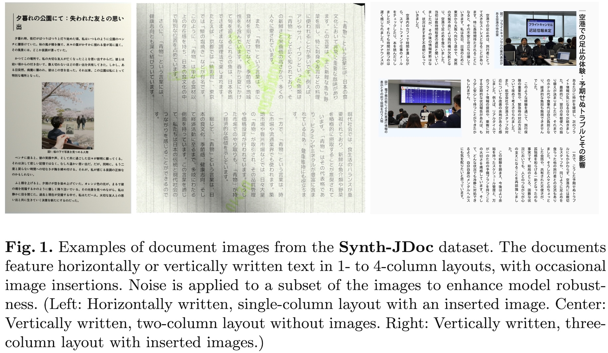
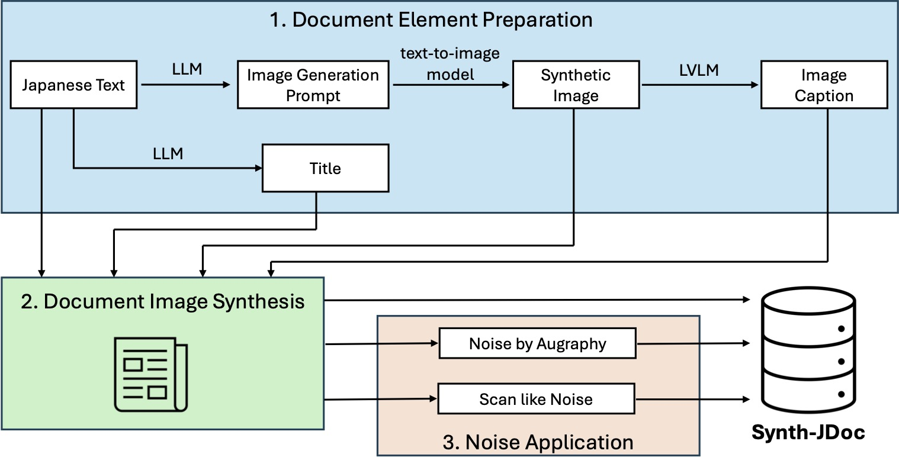

# Synth-JDoc

[Paper]() | [Dataset](https://huggingface.co/datasets/llm-jp/Synth-JDoc)

**Synth-JDoc** is a dataset of Japanese synthetic document images generated using HTML/CSS.



We generate embedded images, captions, and titles from prepared text, and use these elements to synthesize document images featuring diverse multi-column layouts in both vertical and horizontal writing.

Because the document images are synthesized directly from text, this dataset is completely free from OCR errors.



## Release

- Dataset: [llm-jp/Synth-JDoc](https://huggingface.co/datasets/llm-jp/Synth-JDoc)
- Paper: [Synth-JDoc: Synthesizing a Japanese Document Image Dataset for OCR with Diverse Layouts and Embedded Images]()

## Usage

### Installation

Install [uv](https://docs.astral.sh/uv/getting-started/installation/), then run the following commands:

```bash
uv sync
source .venv/bin/activate
playwright install chromium
```

### Datset Construction

Generate data from the text of the [JSSODa](https://huggingface.co/datasets/llm-jp/JSSODa) dataset.

#### Document Element Preparation

1. Create metadata from `llm-jp/JSSODa`
    - `src/data_gen/elements_jssoda.py`
        - `{output_dir}/jssoda_{split}_text_elements.jsonl` will be created.
        - train:
            ```bash
            python src/data_gen/elements_jssoda.py
            ```
        - validation: 
            ```bash
            python src/data_gen/elements_jssoda.py --split validation --output_dir data/JSSODa_validation
            ```
    - `src/data_gen/elements_jssoda_test.py`
        - test:
            ```bash
            python src/data_gen/elements_jssoda_test.py
            ```
2. Determine where to insert images
    - `src/data_gen/img_match_jssoda.py`
        - `{output_dir}/jssoda_{split}_img_match.jsonl` will be created.
        - train:
            ```bash
            python src/data_gen/img_match_jssoda.py
            ```
        - validation: 
            ```bash
            python src/data_gen/img_match_jssoda.py --split validation --input_file_path data/JSSODa_validation/jssoda_validation_text_elements.jsonl --output_dir data/JSSODa_validation
            ```
        - test:
            ```bash
            python src/data_gen/img_match_jssoda.py --split test --input_file_path data/JSSODa_test/jssoda_test_text_elements.jsonl --output_dir data/JSSODa_test 
            ```
3. Generate prompts for image generation
    - `src/data_gen/gen_prompt_jssoda.py`
4. Generate images
    - `src/data_gen/gen_img_jssoda.py`
5. Generate image captions
    - `src/data_gen/gen_caption_jssoda.py`
6. Generate titles
    - `src/data_gen/gen_title_jssoda.py`

#### Document Image Synthesis

Run `src/synth/img_generator.py`. Images are saved at `data/JSSODa/export/images`.

#### Noise Application

- Scan-like Noise
    - Run `src/synth/add_noise_scan.py`
        - Images are saved at `data/JSSODa/export/images_scan`

- Noise by [Augraphy](https://github.com/sparkfish/augraphy)
    - Move to `augraphy` branch
    - Install dependencies
    - Run `src/synth/add_noise_augraphy.py`

### Training

The code for fine-tuning each model is located in `src/train`. Specifically:

- `src/train/`: Contains the code to train models using **Synth-JDoc**.

- `src/train/JSSODa`: Contains the code to train models using [JSSODa](https://huggingface.co/datasets/llm-jp/JSSODa).

- `src/train/nano_banana`: Contains the code to train models using images generated by nano_banana.

### Evaluation

The code to evaluate each model is located in the `src/test` directory. Files with 'tuned' in their filename contain the evaluation code for the fine-tuned models.

## License


## Citation

```

```